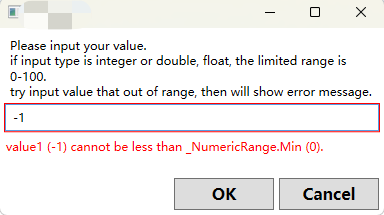
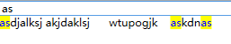

# SharpBoxes

See other related visual studio extensions:[SharpBoxes.Cuts](https://marketplace.visualstudio.com/items?itemName=dumbnessrf.SharpBoxes)
which provided lots of csharp、xaml useful code snippets Like **full property statement with OnPropertyChanged,** **auto surround with Task.Run(()=>{  }**);...

Catalog
- [SharpBoxes](#sharpboxes)
  - [Instruction](#instruction)
  - [Usage](#usage)
    - [EnumBindingSourceExtension](#enumbindingsourceextension)
    - [Command](#command)
    - [Messenger](#messenger)
    - [Navigation](#navigation)
    - [ViewModelBase](#viewmodelbase)
    - [Event Reflection Helper](#event-reflection-helper)
    - [Custom Input Dialog](#custom-input-dialog)
    - [BindablePasswordBox](#bindablepasswordbox)
    - [HighlightTextBlock](#highlighttextblock)
    - [Converters in wpf](#converters-in-wpf)
    

## Instruction
 A package for easy C# and WPF development.

* Simple `CacheHelper` without any other extensions.
* Lots of common `Converters` which are used in WPF.
* Lots of extension method for `String`,`Int`, `Double`, `Float`,  `List`, `Dictionary`... for convert usage
* Integrate Reflection and Linq for easy usage.
* Provided some common user control for WPF, such as `HighlightTextBlock`, `PlaceholderTextBoxControl`, `CustomToolTip`
* Provided Messenger, Navigation, Command, ViewModelBase, Auto Validation for WPF MVVM pattern.
* Provided some dialog extensions for WPF, such as `MessageBox`, `OpenFileDialog`, `SaveFileDialog`, `CustomInputDialog`
* Some preview features in future sdk,`record`, `CallerArgumentExpression`, `RequiredMember`
* ...


## Usage
### EnumBindingSourceExtension
for WPF, you can use `EnumBindingSourceExtension` to bind enum to combobox easily.
```xaml
<ComboBox HorizontalAlignment="Center" VerticalAlignment="Center" MinWidth="150"
      ItemsSource="{Binding Source={local:EnumBindingSource {x:Type local:Status}}}"/>
```
```csharp
public enum Status
{
    Horrible,
    Bad,
    SoSo,
    Good,
    Better,
    Best
}
//similar DisplayName, for custom display name
public enum Status
{
    [DescriptionAttribute("This is horrible")]
    Horrible,
    [DescriptionAttribute("This is bad")]
    Bad,
    [DescriptionAttribute("This is so so")]
    SoSo,
    [DescriptionAttribute("This is good")]
    Good,
    [DescriptionAttribute("This is better")]
    Better,
    [DescriptionAttribute("This is best")]
    Best
}
```
### Command
for WPF, you can use `ActionCommand` to bind command to button easily.
```csharp
private string name;
public string Name
{
    get => name;
    set
    {
        OnPropertyChanging(name, value);
        name = value;
        OnPropertyChanged(name, value);
    }
}
public IActionCommand UpdateSyncCommand { get; private set; }
UpdateSyncCommand = new ActionCommand(
    () =>
    {
        Thread.Sleep(1000);
        this.Name = "James Harden";
    },
    () => true
);
```
or, you can use `AsyncCommand` to bind async command to button easily.
```csharp
private string name;
public string Name
{
    get => name;
    set
    {
        OnPropertyChanging(name, value);
        name = value;
        OnPropertyChanged(name, value);
    }
}
public IAsyncCommand UpdateAsyncCommand { get; private set; }
UpdateAsyncCommand = new AsyncCommand(
    async () =>
    {
        await Task.Delay(1000);
        this.Name = "Clay Tomposon";
    },
    () => true
);
```
Also, you can use `NavigateWithParameterCommand` to bind navigate command to button easily.
```csharp
internal class StudentsViewModel : SharpBoxes.WPFHelpers.ViewModelBase
{
    //...
}
internal class TeachersViewModel : SharpBoxes.WPFHelpers.ViewModelBase
{
    //...
}

public SharpBoxes.WPFHelpers.ViewModelBase SelectedViewModel
{
    get { return selectedViewModel; }
    set
    {
        //若viewmodel被改变，则对应datatemplate的view也会被改变，见app.xaml中定义的对应viewmodel对应view的datatemplate
        selectedViewModel = value;
        OnPropertyChanged();
    }
}
public ICommand NavigateAsyncCommand { get; private set; }
NavigateWithParameterStore<ViewModelBase, string> navigateWithParameterStore =
    new NavigateWithParameterStore<ViewModelBase, string>(
        GetViewModelByParameter,
        (s, vm) => this.SelectedViewModel = vm
    );
navigateWithParameterStore.OnCurrentViewModelChangeAfter += (s, vm) =>
{
    Console.WriteLine($"Current view model changed to {vm}");
};
this.NavigateAsyncCommand = new NavigateWithParameterCommand<string>(
    new NavigateWithParameterService<string, ViewModelBase>(navigateWithParameterStore)
);
private static ViewModelBase GetViewModelByParameter(string s) =>
    s switch
    {
        "Teachers" => new TeachersViewModel(),
        "Students" => new StudentsViewModel(),
        _ => null
    };
```
In xaml
```csharp
<Application
    x:Class="Samples.App"
    xmlns="http://schemas.microsoft.com/winfx/2006/xaml/presentation"
    xmlns:x="http://schemas.microsoft.com/winfx/2006/xaml"
    xmlns:local="clr-namespace:Samples"
    xmlns:views="clr-namespace:Samples.Views"
    xmlns:vm="clr-namespace:Samples.ViewModels"
    StartupUri="Views/MainWindow.xaml">
    <Application.Resources>
        <DataTemplate DataType="{x:Type vm:StudentsViewModel}">
            <views:StudentsView />
        </DataTemplate>
        <DataTemplate DataType="{x:Type vm:TeachersViewModel}">
            <views:TeachersView />
        </DataTemplate>
    </Application.Resources>
</Application>
```
And now, you navigate whatever you want.

### Messenger
For WPF, you can use `Messenger` to send message between ViewModels or any other objects.
With no param pass
```csharp
Messenger.Default.RegisterAction(
"The key of the message with no param",
    () =>
    {
        this.Message = "Receive the message with no param";
    }
);
//Usage
this.SendAsyncCommand = new AsyncCommand(
    () => Messenger.Default.SendAsync("The key of the message with no param")
);
```
With param pass
```csharp
Messenger.Default.RegisterAction(
"The key of the message with param",
 (p) =>
 {
     if (p is StringInput input)
     {
         this.Message = input.Value;
     }
 }
);
//Usage
var rd = new Random();
    this.SendWithParamAsyncCommand = new AsyncCommand(
    () =>
Messenger.Default.SendAsync(
    "The key of the message with param",
    new StringInput($"The value of the message is {rd.Next(1, 100)}")
    )
);
```
Also, you can send a request and get a response, like `ManualResetEvent` in C#.
```csharp
Messenger.Default.RegisterFunc(
    "The key of the message with in and out param",
    (input) =>
    {
        if (input is StringInput stringInput)
        {
            this.Message = $"Receive the message with in param :{stringInput.Value}";
        }
        return new StringOutput("the out value is Happy New Year Too!");
    }
);
//Usage
this.RequestAsyncCommand = new AsyncCommand(async () =>
{
    var res = await Messenger.Default.RequestAsync(
        "The key of the message with in and out param",
        new StringInput("Happy New Year!"),
        CancellationToken.None
    );
    if (res is StringOutput stringOutput)
    {
        SharpBoxes.WPFHelpers.Dialogs.MessageBoxes.Information(stringOutput.Value);
    }
});
```
### Navigation
For WPF, you can use navigate command and navigate service to navigate between pages easily.
```csharp
NavigateWithParameterStore<ViewModelBase, string> navigateWithParameterStore =
    new NavigateWithParameterStore<ViewModelBase, string>(
        GetViewModelByParameter,
        (s, vm) => this.SelectedViewModel = vm
    );
navigateWithParameterStore.OnCurrentViewModelChangeAfter += (s, vm) =>
{
    Console.WriteLine($"Current view model changed to {vm}");
};
navigateWithParameterStore.OnCurrentViewModelChangeBefore += (s, vm) =>
{
    Console.WriteLine($"Current view model changing to {vm}");
};
this.NavigateAsyncCommand = new NavigateWithParameterCommand<string>(
    new NavigateWithParameterService<string, ViewModelBase>(navigateWithParameterStore)
);
private static ViewModelBase GetViewModelByParameter(string s) =>
    s switch
    {
        "Teachers" => new TeachersViewModel(),
        "Students" => new StudentsViewModel(),
        _ => null
    };
```
For full example, please see examples upon [NavigateWithParameterCommand](#command).
### ViewModelBase
For WPF, you can use `ViewModelBase` to implement your viewmodel easily.
```csharp
internal class MainViewModel : SharpBoxes.ViewModelBase
{
    private string name;
    public string Name
    {
        get { return name; }
        set
        {
            name = value;
            OnPropertyChanged();
        }
    }
}
```
### Event Reflection Helper
For C#, you can use `EventHelper` to get event reflection easily.
Get Event Raise Method And Invoke
```csharp
public interface INotifyValueChanged
{
    event EventHandler&lt;NotifyValueChangedEventArgs&gt; OnNotifyValueChanged;
}
var invokeMethod = instance.GetEventHandlerRaiseMethods("OnNotifyValueChanged", typeof(EventHandler&lt;NotifyValueChangedEventArgs&gt;)).FirstOrDefault();
//invokeMethod.Invoke(this, new object[] { null, myEventArgs });
invokeMethod.Method?.Invoke(
invokeMethod.FieldValue,
[
    null,
    new NotifyValueChangedEventArgs()
 ]
);
```
### Custom Input Dialog
For WPF, you can use `DialogManager` to show custom input dialog easily.
```csharp
SharpBoxes.WPFHelpers.Dialogs.DialogManager.ShowInputDialog(
    "Please input your value.\n"
    + "if input type is integer or double, float, the limited range is 0-100.\n"
    + "try input value that out of range, then will show error message.",
    0,
    100,
    InputType,
    out var value,
    "Password"
);
SharpBoxes.WPFHelpers.Dialogs.MessageBoxes.Information(
$"Input: {value}",
"Input Dialog Input");
```

### BindablePasswordBox
For WPF, you can use `BindablePasswordBox` to bind password box easily.
```xaml
xmlns:userControls="clr-namespace:SharpBoxes.WPFHelpers.UserControls;assembly=SharpBoxes"

<userControls:BindablePasswordBox
    Background="AliceBlue"
    Foreground="Red"
    PaddingNew="5"
    Password="{Binding userControlsViewModel.Password}"
    PlaceHolder="Please input password!" />
```
```csharp
private string _password;
public string Password
{
    get { return _password; }
    set
    {
        _password = value;
        OnPropertyChanged();
    }
}
```
### HighlightTextBlock
For WPF, you can use `HighlightTextBlock` to highlight text easily.
```xaml
xmlns:userControls="clr-namespace:SharpBoxes.WPFHelpers.UserControls;assembly=SharpBoxes"

<TextBox Text="{Binding userControlsViewModel.HighlightText, UpdateSourceTrigger=PropertyChanged}" />
<userControls:HighlightTextBlock
    BackgroundHighlight="Yellow"
    ForegroundHighlight="Blue"
    HighlightText="{Binding userControlsViewModel.HighlightText}"
    Text="asdjalksj akjdaklsj      wtupogjk    askdnas" />
```

### Converters in wpf
* `BooleanToVisibilityConverter`
* `BrushToColorConverter`
* `ColorToBrushConverter`
* `StringToSolidColorBrushConverter`

